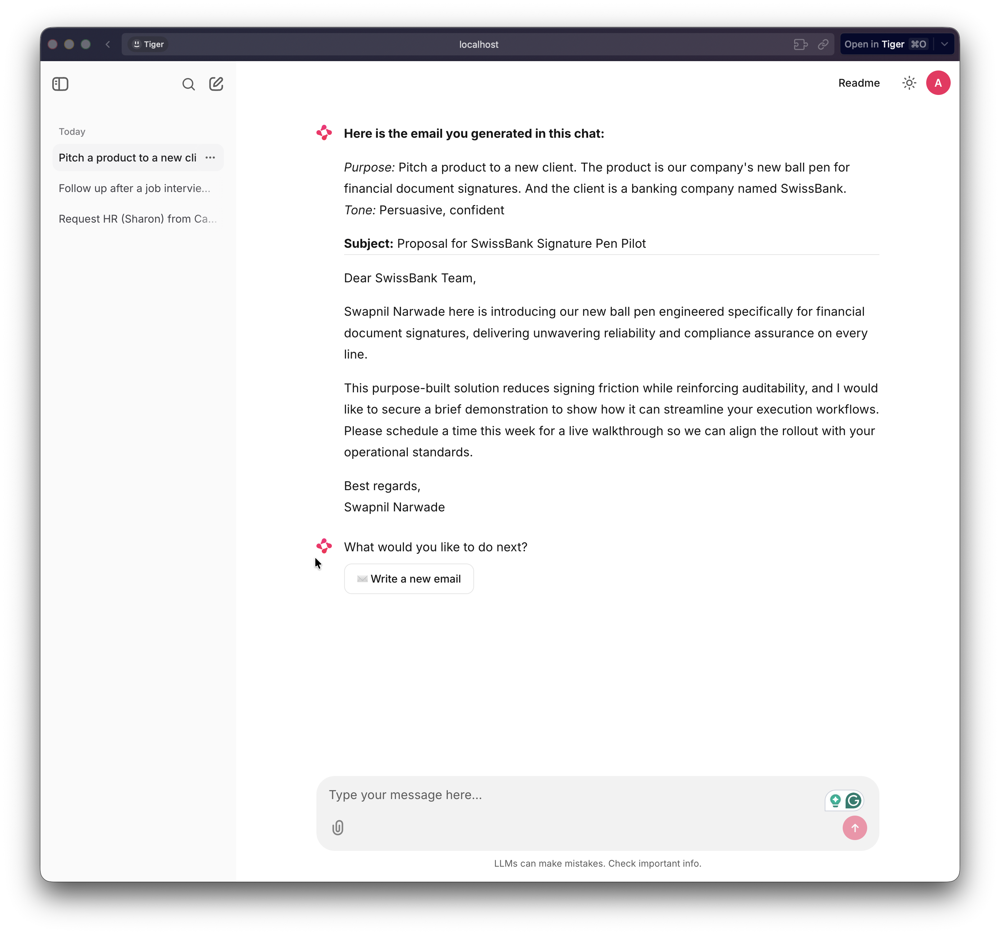

# Email Generation Assistant



An AI-powered professional email generation and evaluation system built with **LangGraph**, **LangChain**, **Pydantic v2**, and **OpenRouter**. Write emails through a conversational UI — no code required — and evaluate their quality with three custom metrics.

---

## Features

- **Chainlit chat interface** — guided multi-step UI for non-technical users (intent → facts → tone → model → email)
- **Persistent chat history** — every generated email is saved; revisit past chats anytime from the sidebar
- **LangGraph-based generator** — CoT reasoning → email generation → structured output parsing
- **LangGraph-based evaluator** — 3 metrics computed in parallel via fan-out graph topology
- **3 custom evaluation metrics:**
  - Fact Coverage (sentence-transformer cosine similarity)
  - Tone Alignment (LLM-as-Judge)
  - Professional Writing Quality (grammar tool + structural regex)
- **A/B model comparison** — run any two OpenRouter models on the same 10 scenarios and produce a side-by-side analysis report
- **Rate-limit resilient** — per-scenario retry with exponential backoff + fallback model list

---

## Local Setup (from GitHub)

### 1. Clone the repository

```bash
git clone https://github.com/Now-Tiger/email-gen-assistant.git
cd email-gen-assistant
```

### 2. Install Python and dependencies

This project requires **Python 3.11+**. We recommend [`uv`](https://docs.astral.sh/uv/) for fast dependency management:

```bash
# Install uv (if you don't have it):
curl -LsSf https://astral.sh/uv/install.sh | sh

# Install all project dependencies:
uv sync
```

<details>
<summary>Using pip instead?</summary>

```bash
python -m venv .venv
source .venv/bin/activate   # Windows: .venv\Scripts\activate
pip install -e .
```

</details>

### 3. Get an OpenRouter API key

1. Go to [https://openrouter.ai/keys](https://openrouter.ai/keys)
2. Sign up (free) and create a key
3. Copy the key — you'll need it in the next step

### 4. Create your `.env` file

```bash
cp .env.example .env
```

Open `.env` and fill in your key:

```
OPENROUTER_API_KEY=sk-or-v1-your-actual-key-here
```

### 5. Generate the Chainlit auth secret

The chat UI requires a secret to sign session tokens. Run this once:

```bash
uv run chainlit create-secret
```

Copy the output line (e.g. `CHAINLIT_AUTH_SECRET="..."`) and paste it into your `.env` file, replacing the placeholder.

Your final `.env` should look like this:

```env
# OpenRouter
OPENROUTER_API_KEY=sk-or-v1-your-key-here
BASE_URL=https://openrouter.ai/api/v1
LLM_MODEL=openai/gpt-4o-mini

# Evaluation models
MODEL_A=openai/gpt-4o-mini
MODEL_B=arcee-ai/trinity-large-preview:free

# Chainlit auth + persistence
CHAINLIT_AUTH_SECRET="your-generated-secret-here"
CHAINLIT_DEFAULT_USER=admin
CHAINLIT_DEFAULT_PASSWORD=admin
DATABASE_URL=sqlite+aiosqlite:///chat_history.db
```

### 6. Launch the chat app

```bash
uv run chainlit run app.py
```

Open [http://localhost:8000](http://localhost:8000) in your browser.

**Login credentials** (set in `.env`, change anytime):

| Field    | Default |
| -------- | ------- |
| Username | `admin` |
| Password | `admin` |

> **Note:** The app does not have a sign-up flow. Only the user configured in `.env` can log in.

---

## Usage

### Chat UI (recommended for non-technical users)

```bash
uv run chainlit run app.py
```

The assistant walks you through five steps:

1. Describe what email you need to write
2. Add key facts (dates, names, numbers)
3. Choose a tone
4. Pick an AI model
5. Review and copy your generated email

Past chats are saved automatically and appear in the sidebar. Click any past chat to see the email that was generated.

---

### Generate a single email (Python / CLI)

```python
from dotenv import load_dotenv
load_dotenv()

from src.generator.graph import generator_graph

result = generator_graph.invoke({
    "intent": "Follow up after a job interview",
    "facts": [
        "Interview was Monday 14 April at 10am",
        "Role: Senior ML Engineer on Recommendations team",
        "Interviewer: Sarah Chen",
        "Team uses PyTorch",
    ],
    "tone": "Formal, grateful",
    "model_name": None,   # uses LLM_MODEL from .env
    "reasoning": None,
    "raw_output": None,
    "subject": None,
    "body": None,
    "error": None,
})

print("Subject:", result["subject"])
print()
print(result["body"])
```

Or run the included demo:

```bash
uv run python main.py
```

### Run the full evaluation pipeline

```bash
# Evaluate Model A (with rate-limit retry and fallback models):
python run_eval.py \
  --model openrouter/elephant-alpha \
  --fallback-models "minimax/minimax-m2.5:free,z-ai/glm-4.5-air:free" \
  --output data/results/model_a.csv \
  --retries 3 \
  --delay 8

# Evaluate Model B:
python run_eval.py \
  --model nvidia/nemotron-3-super-120b-a12b:free \
  --fallback-models "z-ai/glm-4.5-air:free" \
  --output data/results/model_b.csv

# Generate side-by-side comparison report:
python compare_results.py
```

### Run tests

```bash
pytest tests/ -v
```

---

## Project Structure

```
email-gen-assistant/
├── app.py                    # Chainlit chat UI entry point
├── main.py                   # Quick single-email demo script
├── run_eval.py               # CLI: run evaluation for a model, output CSV
├── compare_results.py        # CLI: merge two CSVs into comparison report
├── chainlit.md               # Chainlit welcome screen text
├── pyproject.toml            # Project dependencies
├── .env.example              # Environment variable template
│
├── src/
│   ├── state.py              # TypedDict + Pydantic state models
│   ├── prompts.py            # System prompt, few-shot examples, tone judge prompt
│   ├── utils.py              # get_llm(), load_scenarios(), save_results()
│   ├── generator/
│   │   ├── nodes.py          # cot_reasoning_node, parse_output_node
│   │   └── graph.py          # GeneratorGraph: START → cot_reasoning → parse_output → END
│   └── evaluator/
│       ├── metrics.py        # fact_coverage_score, tone_alignment_score, writing_quality_score
│       ├── nodes.py          # 5 LangGraph nodes (generate + 3 metrics + aggregate)
│       └── graph.py          # EvaluatorGraph: parallel fan-out + aggregate
│
├── data/
│   ├── scenarios.json        # 10 test scenarios with human reference emails
│   └── results/
│       ├── model_a.csv       # elephant-alpha evaluation results
│       ├── model_b.csv       # nemotron-3-super evaluation results
│       └── comparison.csv    # side-by-side per-scenario comparison
│
├── report/
│   └── analysis.md           # Full comparative analysis with findings
│
├── docs/
│   ├── 00-architecture.md    # System architecture reference
│   └── plan-of-action.md            # Full implementation plan
│
└── tests/
    ├── test_generator.py     # Generator graph unit tests
    └── test_metrics.py       # Metric function unit tests
```

---

## Architecture

### Generator Graph

```
START
  └─► cot_reasoning_node   — single LLM call: CoT structural plan + email generation
        └─► parse_output_node  — splits raw output into subject / body
              └─► END
```

The generator uses a **Role-playing + Few-shot + Chain-of-Thought** prompting strategy:

- **Role-playing:** System prompt establishes the model as a senior executive communications specialist, anchoring vocabulary and formality calibration.
- **Few-shot:** Three contrasting examples (formal, casual, urgent) are embedded in the system prompt so the model infers the output schema from worked examples.
- **Chain-of-Thought:** The user template asks the model to commit to a structural plan (audience, CTA, tone strategy) in 2–3 sentences before writing the email, resolving ambiguities upfront.

### Evaluator Graph

```
START
  └─► generate_email_node
        ├─► fact_coverage_node    ─┐
        ├─► tone_alignment_node   ─┼─► aggregate_node → END
        └─► writing_quality_node  ─┘
```

The three metric nodes run **in parallel** (LangGraph fan-out), each returning only the keys they update (partial state deltas) to avoid `InvalidUpdateError` in concurrent branches.

---

## Evaluation Metrics

| #   | Metric              | Method                                                                                                                            | Range |
| --- | ------------------- | --------------------------------------------------------------------------------------------------------------------------------- | ----- |
| 1   | **Fact Coverage**   | `sentence-transformers` cosine similarity between each fact and the generated email body; average over all facts                  | 0–1   |
| 2   | **Tone Alignment**  | LLM-as-Judge: the configured model scores the generated email against the requested tone label on a 0–10 scale, normalised to 0–1 | 0–1   |
| 3   | **Writing Quality** | 50% grammar score (LanguageTool error density) + 50% structural score (regex checks for greeting, sign-off, paragraph count)      | 0–1   |

**Composite score** = arithmetic mean of the three metrics.

---

## Environment Variables

| Variable                    | Required  | Description                                                                  |
| --------------------------- | --------- | ---------------------------------------------------------------------------- |
| `OPENROUTER_API_KEY`        | **Yes**   | Your OpenRouter API key — get one at <https://openrouter.ai/keys>              |
| `BASE_URL`                  | No        | Defaults to `https://openrouter.ai/api/v1`                                   |
| `LLM_MODEL`                 | No        | Default model for generation (fallback: `openai/gpt-4o-mini`)                |
| `MODEL_A`                   | No        | Used by `run_eval.py` default when `--model` is not specified                |
| `MODEL_B`                   | No        | Convenience variable for the second model in A/B runs                        |
| `EVAL_DELAY_SECONDS`        | No        | Inter-scenario delay in seconds (default: 5)                                 |
| `CHAINLIT_AUTH_SECRET`      | **Yes\*** | JWT signing secret — generate with `uv run chainlit create-secret`           |
| `CHAINLIT_DEFAULT_USER`     | No        | Login username for the chat UI (default: `admin`)                            |
| `CHAINLIT_DEFAULT_PASSWORD` | No        | Login password for the chat UI (default: `admin`)                            |
| `DATABASE_URL`              | No        | SQLite URL for chat history (default: `sqlite+aiosqlite:///chat_history.db`) |

\* Required only when running the Chainlit chat UI (`app.py`).

---

## LLM Provider

All models are accessed via [OpenRouter](https://openrouter.ai) using the standard **OpenAI SDK**, with `base_url` pointed at `https://openrouter.ai/api/v1`. Any model listed on OpenRouter can be passed to `--model` in `run_eval.py` or selected in the chat UI.

```python
from langchain_openai import ChatOpenAI

llm = ChatOpenAI(
    base_url="https://openrouter.ai/api/v1",
    api_key="sk-or-...",
    model="openrouter/elephant-alpha",
    temperature=0.7,
)
```

---

## Evaluation Results (April 2026)

| Metric          | `elephant-alpha` | `nemotron-3-super` | Delta  |
| --------------- | ---------------- | ------------------ | ------ |
| Fact Coverage   | 0.904            | 0.895              | +0.009 |
| Tone Alignment  | 0.710            | 0.690              | +0.020 |
| Writing Quality | 0.762            | 0.756              | +0.006 |
| **Composite**   | **0.792**        | **0.780**          | +0.012 |

See [`report/analysis.md`](report/analysis.md) for the full comparative analysis, failure mode breakdown, and production recommendation.

---

## Project Deliverables

This project was built as an applied AI engineering assessment. Here is where each required deliverable lives:

| Deliverable                             | Location in this repo                                                                                                              |
| --------------------------------------- | ---------------------------------------------------------------------------------------------------------------------------------- |
| **Code Repository**                     | This repo — [github.com/Now-Tiger/email-gen-assistant](https://github.com/Now-Tiger/email-gen-assistant)                           |
| **Prompt Template**                     | [`src/prompts.py`](src/prompts.py) — `SYSTEM_PROMPT`, `USER_TEMPLATE`, `TONE_JUDGE_PROMPT`                                         |
| **3 Custom Metric Definitions & Logic** | [`src/evaluator/metrics.py`](src/evaluator/metrics.py) + [`report/analysis.md`](report/analysis.md) §Metric Reliability            |
| **Raw Evaluation Data (CSV)**           | [`data/results/model_a.csv`](data/results/model_a.csv), [`data/results/model_b.csv`](data/results/model_b.csv)                     |
| **Comparative Analysis Summary**        | [`report/analysis.md`](report/analysis.md) — full breakdown with per-scenario scores, failure modes, and production recommendation |
